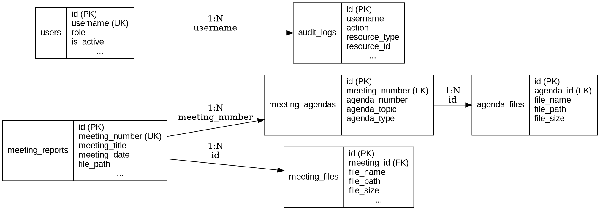
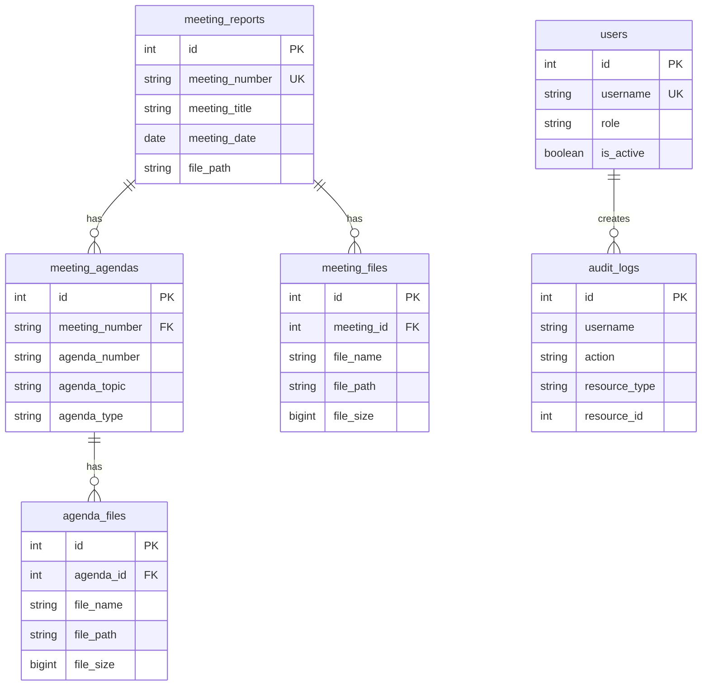

# Meeting Management System - Project Specification

**Version:** 2.0  
**Last Updated:** November 22, 2025  
**Status:** ✅ Production Ready  
**Organization:** โรงพยาบาลลี้ / สำนักงานสาธารณสุขจังหวัดลำพูน

---

## 📋 Table of Contents

1. [บทนำ (Introduction)](#บทนำ-introduction)
2. [แนวคิดและสถาปัตยกรรม (Architecture Overview)](#แนวคิดและสถาปัตยกรรม-architecture-overview)
3. [ความสามารถ (Features & Capabilities)](#ความสามารถ-features--capabilities)
4. [โครงสร้างฐานข้อมูล (Database Schema)](#โครงสร้างฐานข้อมูล-database-schema)
5. [File Upload Flow](#file-upload-flow)
6. [ปัญหาและการแก้ไข (Issues & Fixes)](#ปัญหาและการแก้ไข-issues--fixes)
7. [Database Inspection Scripts](#database-inspection-scripts)
8. [ERD Generation](#erd-generation)
9. [Deployment Checklist](#deployment-checklist)
10. [Files to Modify](#files-to-modify)
11. [สรุป (Summary)](#สรุป-summary)

---

## บทนำ (Introduction)

### ภาพรวมโปรเจกต์

**Meeting Management System** เป็นระบบจัดการการประชุมแบบครบวงจร พัฒนาสำหรับโรงพยาบาลลี้และสำนักงานสาธารณสุขจังหวัดลำพูน 
เพื่อแก้ปัญหาการจัดเก็บเอกสารการประชุมแบบกระจัดกระจาย และการค้นหาเอกสารที่ใช้เวลานาน

### วัตถุประสงค์

1. **จัดเก็บข้อมูลการประชุม** - บันทึกข้อมูลการประชุมทั้งหมดในระบบเดียว
2. **จัดการวาระการประชุม** - สร้างและติดตามวาระการประชุมแต่ละครั้ง
3. **อัพโหลดเอกสาร** - รองรับการอัพโหลดไฟล์หลายประเภท (PDF, DOC, XLS, รูปภาพ, วิดีโอ)
4. **ควบคุมสิทธิ์การใช้งาน** - แบ่งสิทธิ์ตาม role (Secretary, Manager, User)
5. **ติดตามการใช้งาน** - บันทึก audit logs สำหรับทุก action
6. **ค้นหาอย่างรวดเร็ว** - ค้นหาข้อมูลได้ภายใน 5 วินาที

### เทคโนโลยีหลัก

- **Frontend:** React 18.2 + Vite 5.0
- **Backend:** Node.js 18 + Express 4.18
- **Database:** PostgreSQL 14+ (Primary), MariaDB (Authentication)
- **Authentication:** JWT + MD5 password hashing
- **File Storage:** Local filesystem (/uploads)
- **Deployment:** Docker + Docker Compose

---

## แนวคิดและสถาปัตยกรรม (Architecture Overview)

### System Architecture Diagram

```
┌─────────────────────────────────────────────────────────────────┐
│                         CLIENT LAYER                             │
│  ┌──────────────────────────────────────────────────────────┐   │
│  │  React Frontend (Port 5173/8080)                         │   │
│  │  - UI Components (12 components)                         │   │
│  │  - State Management (AuthContext)                        │   │
│  │  - Routing (React Router)                                │   │
│  │  - API Client (Axios + Interceptors)                     │   │
│  └──────────────────────────────────────────────────────────┘   │
└─────────────────────────────────────────────────────────────────┘
                              ↓ HTTP/REST + JWT
┌─────────────────────────────────────────────────────────────────┐
│                       APPLICATION LAYER                          │
│  ┌──────────────────────────────────────────────────────────┐   │
│  │  Express Backend (Port 3001)                             │   │
│  │  ┌────────────────────────────────────────────────────┐  │   │
│  │  │  Middleware Layer                                   │  │   │
│  │  │  - authenticateToken (JWT verification)            │  │   │
│  │  │  - requireSecretary (role check)                   │  │   │
│  │  │  - requireSecretaryOrManager (role check)          │  │   │
│  │  │  - logView, logDownload (audit logging)            │  │   │
│  │  │  - CORS (cross-origin)                             │  │   │
│  │  └────────────────────────────────────────────────────┘  │   │
│  │  ┌────────────────────────────────────────────────────┐  │   │
│  │  │  Routes                                             │  │   │
│  │  │  - /api/auth/* (login, logout, verify)             │  │   │
│  │  │  - /api/meetings/* (CRUD + search)                 │  │   │
│  │  │  - /api/agendas/* (CRUD + files)                   │  │   │
│  │  │  - /api/upload* (file upload)                      │  │   │
│  │  │  - /api/management/* (admin only)                  │  │   │
│  │  └────────────────────────────────────────────────────┘  │   │
│  │  ┌────────────────────────────────────────────────────┐  │   │
│  │  │  File Upload (Multer)                               │  │   │
│  │  │  - Storage: /uploads                                │  │   │
│  │  │  - Max size: 20MB per file                          │  │   │
│  │  │  - Thai filename encoding fix                       │  │   │
│  │  │  - Multiple file types support                      │  │   │
│  │  └────────────────────────────────────────────────────┘  │   │
│  └──────────────────────────────────────────────────────────┘   │
└─────────────────────────────────────────────────────────────────┘
                    ↓                           ↓
┌──────────────────────────────┐  ┌──────────────────────────────┐
│     DATA LAYER (Primary)     │  │   AUTH LAYER (External)      │
│  ┌────────────────────────┐  │  │  ┌────────────────────────┐  │
│  │  PostgreSQL (5432)     │  │  │  │  MariaDB (3306)        │  │
│  │  - meeting_reports     │  │  │  │  - personnel (HR DB)   │  │
│  │  - meeting_agendas     │  │  │  │    * username          │  │
│  │  - meeting_files       │  │  │  │    * password (MD5)    │  │
│  │  - agenda_files        │  │  │  │    * fname, lname      │  │
│  │  - users (roles)       │  │  │  └────────────────────────┘  │
│  │  - audit_logs          │  │  └──────────────────────────────┘
│  └────────────────────────┘  │
└──────────────────────────────┘
                    ↓
┌──────────────────────────────┐
│      STORAGE LAYER           │
│  ┌────────────────────────┐  │
│  │  File System           │  │
│  │  /uploads/             │  │
│  │  - Meeting reports     │  │
│  │  - Agenda files        │  │
│  │  - Multiple files      │  │
│  └────────────────────────┘  │
└──────────────────────────────┘
```

### Component Breakdown

#### Frontend Components (12 total)
1. **App.jsx** - Main app wrapper with routing
2. **AppContent.jsx** - Main content with tabs
3. **Login.jsx** - Login page
4. **MeetingListView.jsx** - Display meetings
5. **MeetingForm.jsx** - Create/edit meeting
6. **UploadForm.jsx** - Upload report
7. **AgendaList.jsx** - Display agendas
8. **AgendaForm.jsx** - Create/edit agenda
9. **ReportStatus.jsx** - Report status view
10. **ProtectedRoute.jsx** - Route protection
11. **RestrictedFeature.jsx** - Role-based UI
12. **ManagementDashboard.jsx** - Admin dashboard

#### Backend Structure
```
backend/
├── src/
│   ├── server.js              # Main server (30+ endpoints)
│   ├── database.js            # PostgreSQL connection
│   ├── config/
│   │   └── mariadb.js         # MariaDB connection
│   ├── middleware/
│   │   ├── auth.js            # JWT authentication
│   │   ├── permissions.js     # Role-based access
│   │   └── audit.js           # Audit logging
│   └── routes/
│       ├── auth.js            # Auth endpoints
│       └── management.js      # Admin endpoints
└── scripts/
    ├── dump_schema_node.js    # Export DB schema
    └── dump_samples.js        # Export sample data
```

---

### Request Flow - สร้างวาระและอัพโหลดไฟล์

```
1. User Login
   ↓
   Frontend: POST /api/auth/login
   ↓
   Backend: Verify credentials (MariaDB personnel table)
   ↓
   Backend: Check role (PostgreSQL users table)
   ↓
   Backend: Generate JWT token
   ↓
   Frontend: Store token in localStorage
   ↓
   Frontend: Redirect to main page

2. Create Agenda with Files
   ↓
   Frontend: User fills AgendaForm + selects files (max 5)
   ↓
   Frontend: Create FormData with agenda data + files
   ↓
   Frontend: POST /api/agendas/with-files (multipart/form-data)
   ↓
   Backend: authenticateToken middleware (verify JWT)
   ↓
   Backend: requireSecretaryOrManager middleware (check role)
   ↓
   Backend: Multer processes files
           - Decode Thai filename (Latin1 → UTF-8)
           - Sanitize filename
           - Save to /uploads with unique name
   ↓
   Backend: INSERT INTO meeting_agendas (agenda data)
   ↓
   Backend: Get agenda_id from INSERT result
   ↓
   Backend: For each file:
           INSERT INTO agenda_files (agenda_id, file_name, file_path, file_size, file_type)
   ↓
   Backend: auditLog (record action)
   ↓
   Backend: Return success response
   ↓
   Frontend: Show success message
   ↓
   Frontend: Refresh agenda list

3. View Agenda with Files
   ↓
   Frontend: GET /api/agendas/:id
   ↓
   Backend: authenticateToken middleware
   ↓
   Backend: SELECT * FROM meeting_agendas WHERE id = $1
   ↓
   Backend: SELECT * FROM agenda_files WHERE agenda_id = $1
   ↓
   Backend: Return agenda + files array
   ↓
   Frontend: Display agenda details + file list
   ↓
   User clicks file link
   ↓
   Browser: GET /uploads/{filename}
   ↓
   Backend: Serve static file (express.static)
   ↓
   Browser: Download/display file
```

---

## ความสามารถ (Features & Capabilities)

### 1. Authentication & Authorization

#### Login System
- **Authentication Source:** MariaDB `personnel` table (HR database)
- **Password:** MD5 hash verification
- **Token:** JWT with configurable expiry (default 24h)
- **Auto-refresh:** Token refresh on API calls
- **Logout:** Clear token + audit log

#### Role-Based Access Control (RBAC)

| Feature | Secretary (เจ้าหน้าที่ธุรการ) | Manager (หัวหน้ากลุ่มงาน) | User (ผู้ใช้ทั่วไป) |
|---------|-------------------------------|---------------------------|---------------------|
| **การประชุม (Meetings)** |
| ดูรายการการประชุม | ✅ | ✅ | ✅ |
| สร้างการประชุม | ✅ | ❌ | ❌ |
| แก้ไขการประชุม | ✅ | ❌ | ❌ |
| ลบการประชุม | ✅ | ❌ | ❌ |
| อัพโหลดรายงาน | ✅ | ❌ | ❌ |
| **วาระ (Agendas)** |
| ดูวาระ | ✅ | ✅ | ✅ |
| สร้างวาระ | ✅ | ✅ | ❌ |
| แก้ไขวาระ | ✅ | ✅ | ❌ |
| ลบวาระ | ✅ | ✅ | ❌ |
| อัพโหลดไฟล์วาระ | ✅ | ✅ | ❌ |
| **รายงาน (Reports)** |
| ดูรายงาน | ✅ | ✅ | ✅ |
| ดาวน์โหลดรายงาน | ✅ | ✅ | ✅ |
| **ระบบ (System)** |
| เข้าถึง Management Tab | ✅ | ❌ | ❌ |
| ดู Audit Logs | ✅ | ❌ | ❌ |

### 2. Meeting Management

#### Core Features
- **Create:** สร้างการประชุมใหม่ (ไม่จำเป็นต้องมีรายงาน)
- **Read:** แสดงรายการและรายละเอียดการประชุม
- **Update:** แก้ไขข้อมูลการประชุม
- **Delete:** ลบการประชุม (Soft delete with is_active flag)
- **Search:** ค้นหาตามชื่อ, เลขที่, สถานที่ (real-time, debounce 500ms)
- **Status:** แสดงสถานะ (มีวาระ X เรื่อง, มีรายงาน/รอรายงาน)

#### Data Fields
```javascript
{
  id: integer (auto-increment),
  meeting_number: string (unique, required),
  meeting_title: string (required),
  meeting_date: date (required),
  meeting_time: time,
  location: string,
  department: string,
  file_path: string (report file),
  file_size: integer,
  created_at: timestamp,
  updated_at: timestamp,
  created_by: string,
  updated_by: string,
  is_active: boolean (default true),
  deleted_at: timestamp
}
```

### 3. Agenda Management

#### Core Features
- **Create:** เพิ่มวาระให้การประชุม (พร้อมไฟล์ได้สูงสุด 5 ไฟล์)
- **Read:** แสดงวาระทั้งหมด (พร้อมไฟล์แนบ)
- **Update:** แก้ไขวาระ (เพิ่ม/ลบไฟล์ได้)
- **Delete:** ลบวาระ (Soft delete)
- **Filter:** กรองตามการประชุม, กลุ่มงาน, ประเภทวาระ
- **Multiple Files:** อัพโหลดได้หลายไฟล์ต่อวาระ

#### Agenda Types (Color Coded)
1. **วาระที่ 3** (เพื่อทราบ) - สีฟ้า `#3b82f6`
2. **วาระที่ 4** (เพื่อพิจารณา) - สีส้ม `#f59e0b`
3. **วาระที่ 5** (เรื่องอื่นๆ) - สีม่วง `#8b5cf6`

#### Departments (10 กลุ่มงาน)
1. กลุ่มงานบริหาร
2. กลุ่มงานพัฒนายุทธศาสตร์สาธารณสุข
3. กลุ่มงานควบคุมโรคติดต่อ
4. กลุ่มงานคุ้มครองผู้บริโภคและเภสัชสาธารณสุข
5. กลุ่มงานส่งเสริมสุขภาพ
6. กลุ่มงานพัฒนาคุณภาพและรูปแบบบริการ
7. กลุ่มงานทันตสาธารณสุข
8. กลุ่มงานการแพทย์แผนไทยและการแพทย์ทางเลือก
9. กลุ่มงานประกันสุขภาพ
10. กลุ่มงานอนามัยสิ่งแวดล้อมและอาชีวอนามัย

### 4. File Upload System

#### Supported File Types
```javascript
// Documents
'application/pdf',                    // .pdf
'application/msword',                 // .doc
'application/vnd.openxmlformats-officedocument.wordprocessingml.document', // .docx
'application/vnd.ms-excel',           // .xls
'application/vnd.openxmlformats-officedocument.spreadsheetml.sheet',       // .xlsx
'application/vnd.ms-powerpoint',      // .ppt
'application/vnd.openxmlformats-officedocument.presentationml.presentation', // .pptx
'text/plain',                         // .txt
'text/markdown',                      // .md
'text/csv',                           // .csv

// Images
'image/jpeg', 'image/jpg', 'image/png', 'image/gif', 'image/bmp', 'image/webp', 'image/svg+xml',

// Archives
'application/zip', 'application/x-rar-compressed', 'application/x-7z-compressed',

// Video
'video/mp4', 'video/mpeg', 'video/quicktime', 'video/x-msvideo', 'video/x-ms-wmv',

// Audio
'audio/mpeg', 'audio/wav', 'audio/ogg', 'audio/mp4'
```

#### File Upload Configuration
- **Max file size:** 20MB per file
- **Max files per upload:** 10 files (meetings), 5 files (agendas)
- **Storage path:** `/uploads` (configurable via UPLOADS_PATH env)
- **Filename format:** `meeting_{timestamp}_{sanitized_original_name}`
- **Thai filename support:** ✅ (Latin1 → UTF-8 conversion)

#### Thai Filename Encoding Fix
```javascript
// Problem: ไฟล์ชื่อภาษาไทยแสดงผลเป็นอักขระพิเศษ
// Solution: Convert encoding + sanitize
const utf8Name = Buffer.from(file.originalname, 'latin1').toString('utf8');
const safeName = utf8Name.replace(/[^\wก-ฮะ-์\. \-]/g, '');
const finalName = `meeting_${Date.now()}_${safeName}`;
```

### 5. Audit Logging

#### Logged Actions
- `login` - User login
- `logout` - User logout
- `create_meeting` - Create meeting
- `update_meeting` - Update meeting
- `delete_meeting` - Delete meeting
- `upload_report` - Upload report
- `create_agenda` - Create agenda
- `update_agenda` - Update agenda
- `delete_agenda` - Delete agenda (soft)
- `view` - View resource

#### Audit Log Data
```javascript
{
  id: integer,
  username: string,
  action: string,
  resource_type: string,
  resource_id: integer,
  details: jsonb,
  ip_address: string,
  user_agent: string,
  created_at: timestamp
}
```

---

## โครงสร้างฐานข้อมูล (Database Schema)

### Database Overview

**Database:** PostgreSQL 14+  
**Schema:** public  
**Tables:** 6 tables  
**Character Encoding:** UTF-8  
**Collation:** C (for Thai language support)

### Tables Summary

| Table | Purpose | Rows (Sample) | Key Relations |
|-------|---------|---------------|---------------|
| `meeting_reports` | การประชุมหลัก | 2 | Parent of agendas, files |
| `meeting_agendas` | วาระการประชุม | 3 | Child of meetings, parent of agenda_files |
| `meeting_files` | ไฟล์การประชุม (หลายไฟล์) | 0 | Child of meetings |
| `agenda_files` | ไฟล์วาระ (หลายไฟล์) | 3 | Child of agendas |
| `users` | ผู้ใช้และสิทธิ์ | 3 | Referenced by audit_logs |
| `audit_logs` | บันทึกการใช้งาน | 10+ | Logs all actions |

---

### Table: meeting_reports

**Purpose:** เก็บข้อมูลการประชุมหลัก

| Column | Type | Nullable | Default | Description |
|--------|------|----------|---------|-------------|
| id | integer | NO | nextval() | Primary key |
| meeting_number | varchar(50) | NO | - | เลขที่การประชุม (unique) |
| meeting_title | varchar(500) | NO | - | ชื่อการประชุม |
| meeting_date | date | NO | - | วันที่ประชุม |
| meeting_time | time | YES | - | เวลาประชุม |
| location | varchar(300) | YES | - | สถานที่ |
| department | varchar(200) | YES | - | หน่วยงาน |
| file_path | varchar(500) | YES | - | ไฟล์รายงาน (single file) |
| file_size | integer | YES | - | ขนาดไฟล์ (bytes) |
| created_at | timestamp | YES | CURRENT_TIMESTAMP | วันที่สร้าง |
| updated_at | timestamp | YES | CURRENT_TIMESTAMP | วันที่แก้ไข |
| created_by | varchar(50) | YES | - | ผู้สร้าง |
| updated_by | integer | YES | - | ผู้แก้ไข |
| is_active | boolean | YES | true | สถานะ (soft delete) |
| deleted_at | timestamp | YES | - | วันที่ลบ |

**Primary Key:** `id`  
**Unique Constraint:** `meeting_number`  
**Indexes:**
- `idx_unique_meeting_number` (UNIQUE) on `meeting_number`
- `idx_meeting_reports_is_active` on `is_active` WHERE is_active = true

**Relationships:**
- **1:N** with `meeting_agendas` (via meeting_number)
- **1:N** with `meeting_files` (via id)

---

### Table: meeting_agendas

**Purpose:** เก็บวาระการประชุม

| Column | Type | Nullable | Default | Description |
|--------|------|----------|---------|-------------|
| id | integer | NO | nextval() | Primary key |
| meeting_number | varchar(50) | NO | - | เลขที่การประชุม (FK) |
| agenda_number | varchar(255) | NO | - | เลขที่วาระ (เช่น 3, 4.1, 5) |
| agenda_topic | varchar(500) | NO | - | หัวข้อวาระ |
| agenda_type | varchar(20) | NO | - | ประเภทวาระ (วาระที่ 3/4/5) |
| submitting_department | varchar(200) | NO | - | กลุ่มงานที่เสนอ |
| description | text | YES | - | รายละเอียด |
| file_path | varchar(500) | YES | - | ไฟล์เดี่ยว (legacy) |
| file_size | integer | YES | - | ขนาดไฟล์ |
| created_at | timestamp | YES | CURRENT_TIMESTAMP | วันที่สร้าง |
| updated_at | timestamp | YES | CURRENT_TIMESTAMP | วันที่แก้ไข |
| created_by | varchar(50) | YES | - | ผู้สร้าง |
| updated_by | varchar(255) | YES | - | ผู้แก้ไข |
| is_active | boolean | YES | true | สถานะ (soft delete) |
| deleted_at | timestamp | YES | - | วันที่ลบ |

**Primary Key:** `id`  
**Foreign Keys:**
- `meeting_number` → `meeting_reports.meeting_number` (ON DELETE CASCADE)

**Indexes:**
- `idx_agenda_meeting_number` on `meeting_number`
- `idx_agenda_type` on `agenda_type`
- `idx_agenda_department` on `submitting_department`
- `idx_agenda_number` on `agenda_number`
- `idx_meeting_agendas_is_active` on `is_active` WHERE is_active = true

**Relationships:**
- **N:1** with `meeting_reports` (via meeting_number)
- **1:N** with `agenda_files` (via id)

---

### Table: meeting_files

**Purpose:** เก็บไฟล์การประชุมหลายไฟล์

| Column | Type | Nullable | Default | Description |
|--------|------|----------|---------|-------------|
| id | integer | NO | nextval() | Primary key |
| meeting_id | integer | YES | - | ID การประชุม (FK) |
| file_name | varchar(255) | NO | - | ชื่อไฟล์ |
| file_path | varchar(500) | NO | - | path ไฟล์ |
| file_size | bigint | YES | - | ขนาดไฟล์ |
| file_type | varchar(255) | YES | - | MIME type |
| uploaded_by | varchar(50) | NO | - | ผู้อัพโหลด |
| created_at | timestamp | YES | now() | วันที่อัพโหลด |

**Primary Key:** `id`  
**Foreign Keys:**
- `meeting_id` → `meeting_reports.id`

**Indexes:**
- `idx_meeting_files_meeting_id` on `meeting_id`

**Relationships:**
- **N:1** with `meeting_reports` (via meeting_id)

---

### Table: agenda_files

**Purpose:** เก็บไฟล์วาระหลายไฟล์

| Column | Type | Nullable | Default | Description |
|--------|------|----------|---------|-------------|
| id | integer | NO | nextval() | Primary key |
| agenda_id | integer | YES | - | ID วาระ (FK) |
| file_name | varchar(255) | NO | - | ชื่อไฟล์ |
| file_path | varchar(500) | NO | - | path ไฟล์ |
| file_size | bigint | YES | - | ขนาดไฟล์ |
| file_type | varchar(255) | YES | - | MIME type |
| uploaded_by | varchar(50) | NO | - | ผู้อัพโหลด |
| created_at | timestamp | YES | now() | วันที่อัพโหลด |
| is_active | boolean | YES | true | สถานะ (soft delete) |
| deleted_at | timestamp | YES | - | วันที่ลบ |

**Primary Key:** `id`  
**Foreign Keys:**
- `agenda_id` → `meeting_agendas.id`

**Indexes:**
- `idx_agenda_files_agenda_id` on `agenda_id`
- `idx_agenda_files_is_active` on `is_active` WHERE is_active = true

**Relationships:**
- **N:1** with `meeting_agendas` (via agenda_id)

---

### Table: users

**Purpose:** เก็บ role และสิทธิ์ผู้ใช้

| Column | Type | Nullable | Default | Description |
|--------|------|----------|---------|-------------|
| id | integer | NO | nextval() | Primary key |
| username | varchar(50) | NO | - | Username (unique) |
| role | varchar(20) | NO | - | Role (secretary/manager/user) |
| department | varchar(100) | YES | - | หน่วยงาน |
| created_at | timestamp | YES | now() | วันที่สร้าง |
| is_active | boolean | YES | true | สถานะ |

**Primary Key:** `id`  
**Unique Constraint:** `username`  
**Check Constraint:** `role IN ('secretary', 'manager', 'user')`

**Indexes:**
- `users_username_key` (UNIQUE) on `username`
- `idx_users_role` on `role`
- `idx_users_username` on `username`

**Relationships:**
- Referenced by `audit_logs` (via username)

---

### Table: audit_logs

**Purpose:** บันทึกการใช้งานทั้งหมด

| Column | Type | Nullable | Default | Description |
|--------|------|----------|---------|-------------|
| id | integer | NO | nextval() | Primary key |
| username | varchar(50) | YES | - | ผู้ใช้ |
| action | varchar(50) | YES | - | Action (login, create, etc.) |
| resource_type | varchar(100) | YES | - | ประเภท resource |
| resource_id | integer | YES | - | ID ของ resource |
| details | varchar(255) | YES | - | รายละเอียดเพิ่มเติม |
| ip_address | varchar(45) | YES | - | IP address |
| user_agent | text | YES | - | Browser/client info |
| created_at | timestamp | YES | now() | วันที่บันทึก |

**Primary Key:** `id`

**Indexes:**
- `idx_audit_logs_username` on `username`
- `idx_audit_logs_resource` on `(resource_type, resource_id)`
- `idx_audit_logs_created_at` on `created_at`

**Relationships:**
- References `users` (via username, no FK constraint)

---

### Entity Relationship Diagram (Text Format)

```
┌─────────────────────┐
│  meeting_reports    │
│  (การประชุม)         │
├─────────────────────┤
│ PK: id              │
│ UK: meeting_number  │
│     meeting_title   │
│     meeting_date    │
│     file_path       │
│     ...             │
└──────────┬──────────┘
           │ 1
           │
           │ N
┌──────────┴──────────┐         ┌─────────────────────┐
│  meeting_agendas    │         │  meeting_files      │
│  (วาระ)              │         │  (ไฟล์การประชุม)     │
├─────────────────────┤         ├─────────────────────┤
│ PK: id              │         │ PK: id              │
│ FK: meeting_number  │         │ FK: meeting_id      │
│     agenda_number   │         │     file_name       │
│     agenda_topic    │         │     file_path       │
│     agenda_type     │         │     file_size       │
│     ...             │         │     ...             │
└──────────┬──────────┘         └─────────────────────┘
           │ 1
           │
           │ N
┌──────────┴──────────┐
│  agenda_files       │
│  (ไฟล์วาระ)          │
├─────────────────────┤
│ PK: id              │
│ FK: agenda_id       │
│     file_name       │
│     file_path       │
│     file_size       │
│     ...             │
└─────────────────────┘

┌─────────────────────┐         ┌─────────────────────┐
│  users              │         │  audit_logs         │
│  (ผู้ใช้)            │◄────────│  (บันทึกการใช้งาน)   │
├─────────────────────┤         ├─────────────────────┤
│ PK: id              │         │ PK: id              │
│ UK: username        │         │     username        │
│     role            │         │     action          │
│     is_active       │         │     resource_type   │
│     ...             │         │     resource_id     │
└─────────────────────┘         │     ...             │
                                └─────────────────────┘
```

### Key Relationships

1. **meeting_reports → meeting_agendas** (1:N)
   - One meeting can have multiple agendas
   - FK: `meeting_agendas.meeting_number` → `meeting_reports.meeting_number`
   - ON DELETE CASCADE

2. **meeting_reports → meeting_files** (1:N)
   - One meeting can have multiple files
   - FK: `meeting_files.meeting_id` → `meeting_reports.id`

3. **meeting_agendas → agenda_files** (1:N)
   - One agenda can have multiple files
   - FK: `agenda_files.agenda_id` → `meeting_agendas.id`

4. **users ← audit_logs** (1:N, no FK)
   - One user can have multiple audit logs
   - Soft reference via username

---

## File Upload Flow

### Upload Flow Diagram

```
┌─────────────────────────────────────────────────────────────────┐
│ 1. User selects files in frontend                               │
│    - AgendaForm: max 5 files                                    │
│    - UploadForm (meeting): max 10 files                         │
└────────────────────────────┬────────────────────────────────────┘
                             ↓
┌─────────────────────────────────────────────────────────────────┐
│ 2. Frontend creates FormData                                    │
│    formData.append('files', file1)                              │
│    formData.append('files', file2)                              │
│    formData.append('agenda_topic', 'หัวข้อ')                    │
│    ...                                                           │
└────────────────────────────┬────────────────────────────────────┘
                             ↓
┌─────────────────────────────────────────────────────────────────┐
│ 3. POST /api/agendas/with-files                                 │
│    Headers: Authorization: Bearer {JWT}                         │
│    Content-Type: multipart/form-data                            │
└────────────────────────────┬────────────────────────────────────┘
                             ↓
┌─────────────────────────────────────────────────────────────────┐
│ 4. Backend Middleware Chain                                     │
│    ├─ authenticateToken (verify JWT)                            │
│    ├─ requireSecretaryOrManager (check role)                    │
│    └─ multer.array('files', 5) (process files)                  │
└────────────────────────────┬────────────────────────────────────┘
                             ↓
┌─────────────────────────────────────────────────────────────────┐
│ 5. Multer File Processing                                       │
│    For each file:                                               │
│    ├─ Decode filename: Latin1 → UTF-8                           │
│    │  const utf8Name = Buffer.from(                             │
│    │    file.originalname, 'latin1'                             │
│    │  ).toString('utf8');                                       │
│    │                                                             │
│    ├─ Sanitize filename                                         │
│    │  const safeName = utf8Name.replace(                        │
│    │    /[^\wก-ฮะ-์\. \-]/g, ''                                 │
│    │  );                                                         │
│    │                                                             │
│    ├─ Generate unique filename                                  │
│    │  const finalName =                                         │
│    │    `meeting_${Date.now()}_${safeName}`;                    │
│    │                                                             │
│    ├─ Validate file type (MIME + extension)                     │
│    │                                                             │
│    ├─ Check file size (max 20MB)                                │
│    │                                                             │
│    └─ Save to /uploads/{finalName}                              │
└────────────────────────────┬────────────────────────────────────┘
                             ↓
┌─────────────────────────────────────────────────────────────────┐
│ 6. Database Operations (Transaction)                            │
│    BEGIN;                                                        │
│    ├─ INSERT INTO meeting_agendas (...)                         │
│    │  RETURNING id AS agenda_id;                                │
│    │                                                             │
│    ├─ For each uploaded file:                                   │
│    │  INSERT INTO agenda_files (                                │
│    │    agenda_id,                                              │
│    │    file_name,      -- original name (UTF-8)                │
│    │    file_path,      -- /uploads/{finalName}                 │
│    │    file_size,      -- bytes                                │
│    │    file_type,      -- MIME type                            │
│    │    uploaded_by     -- username from JWT                    │
│    │  );                                                         │
│    │                                                             │
│    └─ INSERT INTO audit_logs (...)                              │
│    COMMIT;                                                       │
└────────────────────────────┬────────────────────────────────────┘
                             ↓
┌─────────────────────────────────────────────────────────────────┐
│ 7. Response to Frontend                                         │
│    {                                                             │
│      success: true,                                             │
│      message: 'Agenda created successfully',                    │
│      data: { id, meeting_number, ... },                         │
│      files_uploaded: 3                                          │
│    }                                                             │
└────────────────────────────┬────────────────────────────────────┘
                             ↓
┌─────────────────────────────────────────────────────────────────┐
│ 8. Frontend Updates UI                                          │
│    - Show success message                                       │
│    - Refresh agenda list                                        │
│    - Close form modal                                           │
└─────────────────────────────────────────────────────────────────┘
```

### File Retrieval Flow

```
┌─────────────────────────────────────────────────────────────────┐
│ 1. User clicks file link in UI                                  │
│    <a href="/uploads/meeting_1732012345_รายงาน.pdf">            │
└────────────────────────────┬────────────────────────────────────┘
                             ↓
┌─────────────────────────────────────────────────────────────────┐
│ 2. Browser sends GET request                                    │
│    GET /uploads/meeting_1732012345_รายงาน.pdf                   │
└────────────────────────────┬────────────────────────────────────┘
                             ↓
┌─────────────────────────────────────────────────────────────────┐
│ 3. Express Static Middleware                                    │
│    app.use('/uploads', express.static(UPLOADS_PATH))            │
│    - Serves file from filesystem                                │
│    - Sets proper Content-Type header                            │
│    - Handles UTF-8 filename encoding                            │
└────────────────────────────┬────────────────────────────────────┘
                             ↓
┌─────────────────────────────────────────────────────────────────┐
│ 4. Browser receives file                                        │
│    - PDF: Display in browser                                    │
│    - Image: Display inline                                      │
│    - Other: Download                                            │
└─────────────────────────────────────────────────────────────────┘
```

### File Storage Structure

```
uploads/
├── meeting_1732012345_รายงานการประชุม.pdf
├── meeting_1732012346_วาระที่3.docx
├── meeting_1732012347_สรุปผล.xlsx
├── meeting_1732012348_รูปภาพ.jpg
└── meeting_1732012349_วิดีโอ.mp4
```

### Database Records

**agenda_files table:**
```sql
id | agenda_id | file_name              | file_path                                    | file_size | file_type        | uploaded_by
---|-----------|------------------------|----------------------------------------------|-----------|------------------|-------------
1  | 5         | รายงานการประชุม.pdf     | /uploads/meeting_1732012345_รายงานการประชุม.pdf | 2150000   | application/pdf  | admin
2  | 5         | วาระที่3.docx          | /uploads/meeting_1732012346_วาระที่3.docx      | 450000    | application/vnd... | admin
3  | 5         | สรุปผล.xlsx            | /uploads/meeting_1732012347_สรุปผล.xlsx        | 320000    | application/vnd... | admin
```

### Thai Filename Encoding Solution

#### Problem
```javascript
// Original filename from browser: "รายงาน.pdf"
// Received by multer: "รายà¸à¸²à¸.pdf" (garbled)
```

#### Solution
```javascript
// In multer storage configuration
filename: (req, file, cb) => {
  // Step 1: Convert Latin1 → UTF-8
  const utf8Name = Buffer.from(file.originalname, 'latin1').toString('utf8');
  // Result: "รายงาน.pdf" ✅

  // Step 2: Sanitize (remove unsafe characters)
  const safeName = utf8Name.replace(/[^\wก-ฮะ-์\. \-]/g, '');
  // Keeps: Thai chars (ก-ฮ, ะ-์), alphanumeric, dot, space, dash

  // Step 3: Add timestamp prefix
  const finalName = `meeting_${Date.now()}_${safeName}`;
  // Result: "meeting_1732012345_รายงาน.pdf" ✅

  cb(null, finalName);
}
```

#### Alternative Solutions (if needed)

**Option 1: Store original_name separately**
```sql
ALTER TABLE agenda_files 
ADD COLUMN original_name VARCHAR(255);

-- Store both sanitized path and original name
INSERT INTO agenda_files (file_name, file_path, original_name)
VALUES (
  'meeting_1732012345_report.pdf',
  '/uploads/meeting_1732012345_report.pdf',
  'รายงานการประชุม.pdf'  -- Original Thai name
);
```

**Option 2: Use iconv-lite library**
```javascript
const iconv = require('iconv-lite');

filename: (req, file, cb) => {
  const utf8Name = iconv.decode(
    Buffer.from(file.originalname, 'binary'),
    'utf8'
  );
  // ...
}
```

**Option 3: URL encode filename**
```javascript
const encodedName = encodeURIComponent(file.originalname);
// "รายงาน.pdf" → "%E0%B8%A3%E0%B8%B2%E0%B8%A2%E0%B8%87%E0%B8%B2%E0%B8%99.pdf"
```

---

## ปัญหาและการแก้ไข (Issues & Fixes)

### 1. Authentication Token Issue ✅ FIXED

**Problem:**
- 401 Unauthorized error on all API calls after login
- Token was generated but not being sent with requests

**Root Cause:**
- Missing request/response interceptors in axios client
- Token not automatically attached to headers

**Solution:**
```javascript
// frontend/src/services/api.js

// Request interceptor - add token to all requests
api.interceptors.request.use(
  (config) => {
    const token = localStorage.getItem('token');
    if (token) {
      config.headers.Authorization = `Bearer ${token}`;
    }
    return config;
  },
  (error) => Promise.reject(error)
);

// Response interceptor - handle 401 errors
api.interceptors.response.use(
  (response) => response,
  (error) => {
    if (error.response?.status === 401) {
      localStorage.removeItem('token');
      window.location.href = '/login';
    }
    return Promise.reject(error);
  }
);
```

**Files Modified:**
- `frontend/src/services/api.js`

---

### 2. User Login Issue (Default Role) ✅ FIXED

**Problem:**
- Users not in `users` table couldn't login
- Only users with explicit roles could access system

**Root Cause:**
- Login endpoint required user record in `users` table
- No default role for regular users

**Solution:**
```javascript
// backend/src/routes/auth.js

// Check role from PostgreSQL users table
const roleResult = await db.query(
  'SELECT role, is_active FROM users WHERE username = $1',
  [username]
);

let role = 'user'; // Default role for users not in users table
let isActive = true;

if (roleResult.rows.length > 0) {
  const userRecord = roleResult.rows[0];
  role = userRecord.role;
  isActive = userRecord.is_active;

  if (!isActive) {
    return res.status(403).json({
      success: false,
      message: 'บัญชีผู้ใช้ถูกระงับการใช้งาน'
    });
  }
}

// Generate JWT token for everyone (including default users)
const token = jwt.sign({ username, role, ... }, ...);
```

**Files Modified:**
- `backend/src/routes/auth.js`

---

### 3. Thai Filename Encoding ✅ FIXED

**Problem:**
- Thai filenames displayed as garbled characters
- Example: "รายงาน.pdf" → "รายà¸à¸²à¸.pdf"

**Root Cause:**
- Multer receives filename in Latin1 encoding
- Need to convert to UTF-8

**Solution:**
```javascript
// backend/src/server.js - multer configuration

const storage = multer.diskStorage({
  filename: (req, file, cb) => {
    // Convert Latin1 → UTF-8
    const utf8Name = Buffer.from(file.originalname, 'latin1').toString('utf8');
    
    // Sanitize filename
    const safeName = utf8Name.replace(/[^\wก-ฮะ-์\. \-]/g, '');
    
    // Add timestamp prefix
    const finalName = `meeting_${Date.now()}_${safeName}`;
    
    cb(null, finalName);
  }
});
```

**Files Modified:**
- `backend/src/server.js`

---

### 4. Multiple File Upload UI ✅ FIXED

**Problem:**
- MultipleFileUpload component created but not integrated
- Users couldn't upload multiple files

**Root Cause:**
- Component existed but wasn't used in forms
- Missing integration in AgendaForm and UploadForm

**Solution:**
- Integrated MultipleFileUpload component
- Added file list display
- Implemented file removal functionality

**Files Modified:**
- `frontend/src/components/AgendaForm.jsx`
- `frontend/src/components/UploadForm.jsx`

---

### 5. 500 Error on Report Upload ✅ FIXED

**Problem:**
- 500 Internal Server Error when uploading report
- SQL parameter mismatch

**Root Cause:**
```sql
-- Query had $4 parameter but only 3 values provided
UPDATE meeting_reports 
SET file_path = $1, file_size = $2, updated_by = $3
WHERE id = $4  -- Missing 4th parameter!
```

**Solution:**
```javascript
// Fixed parameter order
const result = await db.query(
  `UPDATE meeting_reports 
   SET file_path = $1, file_size = $2, updated_at = CURRENT_TIMESTAMP, updated_by = $3
   WHERE id = $4 
   RETURNING *`,
  [`/uploads/${req.file.filename}`, req.file.size, req.user.username, meetingId]
  // Now has 4 parameters matching $1, $2, $3, $4
);
```

**Files Modified:**
- `backend/src/server.js`

---

### 6. Foreign Key Constraint on Delete ✅ FIXED

**Problem:**
- Cannot delete agenda because of FK constraint with agenda_files
- Error: "violates foreign key constraint"

**Root Cause:**
- Hard delete tried to remove agenda with existing files
- FK constraint prevented deletion

**Solution:**
- Implemented soft delete for agendas and files
- Added `is_active` and `deleted_at` columns
- Modified queries to filter by `is_active = TRUE`

```sql
-- Soft delete agenda
UPDATE meeting_agendas 
SET is_active = FALSE, deleted_at = NOW()
WHERE id = $1;

-- Soft delete related files
UPDATE agenda_files 
SET is_active = FALSE, deleted_at = NOW()
WHERE agenda_id = $1;
```

**Files Modified:**
- `backend/src/server.js`
- `database/database_migration_soft_delete.sql`

---

## Database Inspection Scripts

### Script 1: dump_schema_node.js

**Purpose:** Export complete database schema to JSON and Markdown

**Location:** `backend/scripts/dump_schema_node.js`

**Usage:**
```bash
# From project root
node backend/scripts/dump_schema_node.js

# Output files:
# - backend/db_schema.json (complete schema)
# - backend/db_schema.md (markdown summary)
```

**Environment Variables Required:**
```bash
DB_HOST=localhost
DB_PORT=5432
DB_NAME=meeting_mgmt
DB_USER=postgres
DB_PASS=your_password
```

**What it exports:**
- All table names
- Column definitions (name, type, nullable, default, max_length)
- Primary keys
- Foreign keys (with referenced tables)
- Indexes (with definitions)

**Output Example (db_schema.json):**
```json
{
  "meeting_reports": {
    "columns": [
      {
        "column_name": "id",
        "data_type": "integer",
        "is_nullable": "NO",
        "column_default": "nextval('meeting_reports_id_seq'::regclass)"
      },
      ...
    ],
    "primary_keys": [
      { "column_name": "id" }
    ],
    "foreign_keys": [],
    "indexes": [
      {
        "indexname": "meeting_reports_pkey",
        "indexdef": "CREATE UNIQUE INDEX ..."
      }
    ]
  }
}
```

---

### Script 2: dump_samples.js

**Purpose:** Export sample data from all tables

**Location:** `backend/scripts/dump_samples.js`

**Usage:**
```bash
node backend/scripts/dump_samples.js

# Output: backend/db_samples.json
```

**What it exports:**
- 5 rows from `meeting_reports`
- 5 rows from `meeting_agendas`
- 5 rows from `meeting_files`
- 5 rows from `agenda_files`
- 5 rows from `users`
- 10 rows from `audit_logs`

---

### Manual SQL Queries

**Get all tables:**
```sql
SELECT table_name
FROM information_schema.tables
WHERE table_schema='public' AND table_type='BASE TABLE'
ORDER BY table_name;
```

**Get columns for a table:**
```sql
SELECT 
  column_name, 
  data_type, 
  is_nullable, 
  column_default,
  character_maximum_length
FROM information_schema.columns
WHERE table_name = 'meeting_reports'
ORDER BY ordinal_position;
```

**Get foreign keys:**
```sql
SELECT
  kcu.column_name,
  ccu.table_name AS foreign_table_name,
  ccu.column_name AS foreign_column_name,
  tc.constraint_name
FROM information_schema.table_constraints AS tc
JOIN information_schema.key_column_usage AS kcu
  ON tc.constraint_name = kcu.constraint_name
JOIN information_schema.constraint_column_usage AS ccu
  ON ccu.constraint_name = tc.constraint_name
WHERE tc.constraint_type = 'FOREIGN KEY' 
  AND tc.table_name='meeting_agendas';
```

**Get indexes:**
```sql
SELECT indexname, indexdef
FROM pg_indexes
WHERE tablename = 'meeting_reports';
```

**Get table sizes:**
```sql
SELECT 
  schemaname,
  tablename,
  pg_size_pretty(pg_total_relation_size(schemaname||'.'||tablename)) AS size
FROM pg_tables
WHERE schemaname = 'public'
ORDER BY pg_total_relation_size(schemaname||'.'||tablename) DESC;
```

---

## ERD Generation

### Method 1: Using Graphviz (Recommended)

**Install Graphviz:**
```bash
# Windows (using Chocolatey)
choco install graphviz

# macOS
brew install graphviz

# Ubuntu/Debian
sudo apt-get install graphviz
```

**Create ERD file (erd.dot):**


**Generate PNG:**
```bash
dot -Tpng erd.dot -o erd.png
```

**Generate SVG:**
```bash
dot -Tsvg erd.dot -o erd.svg
```

---

### Method 2: Using Mermaid (Markdown-friendly)

**Create mermaid file (erd.mmd):**


**Render online:**
- https://mermaid.live/
- Paste code and export as PNG/SVG

---

### Method 3: Using pgAdmin

1. Open pgAdmin
2. Connect to database
3. Right-click on database → "Generate ERD"
4. Arrange tables
5. Export as PNG/SVG

---

### Method 4: Using DBeaver

1. Open DBeaver
2. Connect to database
3. Right-click on database → "View Diagram"
4. Export as image

---

## Deployment Checklist

### Pre-Deployment

- [ ] **Environment Variables**
  ```bash
  # Backend (.env)
  DB_HOST=your_db_host
  DB_PORT=5432
  DB_NAME=meeting_mgmt
  DB_USER=postgres
  DB_PASS=secure_password
  PORT=3001
  
  # MariaDB (Authentication)
  MARIADB_HOST=your_mariadb_host
  MARIADB_PORT=3306
  MARIADB_DATABASE=hr
  MARIADB_USER=root
  MARIADB_PASSWORD=secure_password
  
  # JWT
  JWT_SECRET=generate_random_secret_here
  JWT_EXPIRES_IN=24h
  
  # Uploads
  UPLOADS_PATH=/app/uploads
  
  # Frontend (.env)
  VITE_API_URL=http://your_server_ip:3001/api
  ```

- [ ] **Database Setup**
  ```bash
  # Create database
  createdb -h localhost -U postgres meeting_mgmt
  
  # Run migrations
  psql -h localhost -U postgres -d meeting_mgmt -f init.sql
  psql -h localhost -U postgres -d meeting_mgmt -f database/auth-schema.sql
  psql -h localhost -U postgres -d meeting_mgmt -f database/agendas-schema.sql
  ```

- [ ] **Security**
  - [ ] Change default JWT_SECRET
  - [ ] Use strong database passwords
  - [ ] Configure firewall rules
  - [ ] Enable HTTPS (use reverse proxy)
  - [ ] Set up SSL for database connections

- [ ] **CORS Configuration**
  ```javascript
  // backend/src/server.js
  app.use(cors({
    origin: [
      'http://your_domain.com',
      'http://your_server_ip:3000'
    ],
    credentials: true
  }));
  ```

- [ ] **File Storage**
  - [ ] Create uploads directory
  - [ ] Set proper permissions (755)
  - [ ] Configure backup for uploads
  - [ ] Set up volume mount for Docker

---

### Deployment Methods

#### Method 1: Docker Compose (Recommended)

**1. Create .env file:**
```bash
cp backend/.env.example backend/.env
# Edit backend/.env with production values
```

**2. Build and start:**
```bash
docker-compose -f docker-compose.production.yml up -d --build
```

**3. Check status:**
```bash
docker-compose -f docker-compose.production.yml ps
docker-compose -f docker-compose.production.yml logs -f
```

**4. Access:**
- Frontend: http://your_server_ip:3000
- Backend: http://your_server_ip:3001
- pgAdmin: http://your_server_ip:5050 (optional)

---

#### Method 2: Manual Deployment

**1. Backend:**
```bash
cd backend
npm ci --production
node src/server.js
```

**2. Frontend:**
```bash
cd frontend
npm ci
npm run build
# Serve dist/ with nginx or serve
```

**3. Nginx configuration:**
```nginx
server {
    listen 80;
    server_name your_domain.com;
    
    # Frontend
    location / {
        root /path/to/frontend/dist;
        try_files $uri $uri/ /index.html;
    }
    
    # Backend API
    location /api {
        proxy_pass http://localhost:3001;
        proxy_http_version 1.1;
        proxy_set_header Upgrade $http_upgrade;
        proxy_set_header Connection 'upgrade';
        proxy_set_header Host $host;
        proxy_cache_bypass $http_upgrade;
    }
    
    # Uploads
    location /uploads {
        proxy_pass http://localhost:3001;
    }
}
```

---

### Post-Deployment

- [ ] **Health Checks**
  ```bash
  # Backend health
  curl http://your_server_ip:3001/api/health
  
  # Frontend
  curl http://your_server_ip:3000
  ```

- [ ] **Test Login**
  - [ ] Login with test user
  - [ ] Verify JWT token
  - [ ] Check role permissions

- [ ] **Test File Upload**
  - [ ] Upload Thai filename
  - [ ] Upload multiple files
  - [ ] Download file
  - [ ] Verify file encoding

- [ ] **Monitoring**
  - [ ] Set up log rotation
  - [ ] Configure monitoring (PM2, New Relic, etc.)
  - [ ] Set up alerts
  - [ ] Monitor disk space (uploads folder)

- [ ] **Backup**
  - [ ] Database backup script
  - [ ] Uploads backup
  - [ ] Automated backup schedule

---

### Dynamic API_BASE Configuration

**Problem:** Hardcoded IP address doesn't work on different networks

**Solution 1: Use window.location (Frontend)**
```javascript
// frontend/src/services/api.js
const getApiUrl = () => {
  if (import.meta.env.VITE_API_URL) {
    return import.meta.env.VITE_API_URL;
  }
  
  // Dynamic: use current hostname
  const protocol = window.location.protocol;
  const hostname = window.location.hostname;
  return `${protocol}//${hostname}:3001/api`;
};

const API_URL = getApiUrl();
```

**Solution 2: Environment Variable**
```bash
# .env.production
VITE_API_URL=http://your_server_ip:3001/api
```

**Solution 3: Reverse Proxy**
```nginx
# All requests to /api go to backend
location /api {
    proxy_pass http://localhost:3001;
}

# Frontend uses relative URL
const API_URL = '/api';
```

---

### Host Binding (0.0.0.0)

**Problem:** Server only accessible from localhost

**Solution:**
```javascript
// backend/src/server.js
app.listen(PORT, '0.0.0.0', () => {
  console.log(`Server running on 0.0.0.0:${PORT}`);
});
```

**Firewall:**
```bash
# Allow port 3001
sudo ufw allow 3001/tcp

# Check status
sudo ufw status
```

---

## Files to Modify

### For Production Deployment

**1. backend/.env**
```bash
# Change these values
DB_HOST=production_db_host
DB_PASS=strong_password
JWT_SECRET=random_secret_key_here
MARIADB_HOST=production_mariadb_host
MARIADB_PASSWORD=strong_password
```

**2. frontend/.env**
```bash
# Set production API URL
VITE_API_URL=http://your_server_ip:3001/api
# or use dynamic detection (no .env needed)
```

**3. backend/src/server.js**
```javascript
// Line 20-40: CORS configuration
app.use(cors({
  origin: [
    'http://your_domain.com',
    'http://your_server_ip:3000'
  ],
  credentials: true
}));

// Line 1250: Host binding
app.listen(PORT, '0.0.0.0', () => {
  console.log(`Server running on 0.0.0.0:${PORT}`);
});
```

**4. docker-compose.production.yml**
```yaml
# Update environment variables
environment:
  DB_HOST: your_db_host
  JWT_SECRET: your_secret_here
  # ...
```

---

### For Thai Filename Fix (Already Applied)

**backend/src/server.js** (Lines 70-85)
```javascript
const storage = multer.diskStorage({
  filename: (req, file, cb) => {
    // Convert Latin1 → UTF-8
    const utf8Name = Buffer.from(file.originalname, 'latin1').toString('utf8');
    const safeName = utf8Name.replace(/[^\wก-ฮะ-์\. \-]/g, '');
    const finalName = `meeting_${Date.now()}_${safeName}`;
    cb(null, finalName);
  }
});
```

---

### For Database Connection

**backend/src/database.js**
```javascript
const pool = new Pool({
  host: process.env.DB_HOST,
  port: process.env.DB_PORT,
  database: process.env.DB_NAME,
  user: process.env.DB_USER,
  password: process.env.DB_PASS,
  // Add for production:
  ssl: process.env.DB_SSL === 'true' ? { rejectUnauthorized: false } : false,
  max: 20, // connection pool size
  idleTimeoutMillis: 30000,
  connectionTimeoutMillis: 2000,
});
```

---

## สรุป (Summary)

### What Changed

**Phase 1: Core System**
- ✅ Meeting management (CRUD)
- ✅ Search functionality
- ✅ File upload (single)
- ✅ PostgreSQL database

**Phase 2A: Authentication**
- ✅ JWT authentication
- ✅ Role-based access control
- ✅ MariaDB integration
- ✅ Audit logging

**Phase 2B: Advanced Features**
- ✅ Agenda management
- ✅ Multiple file upload
- ✅ Soft delete
- ✅ Thai filename encoding fix

**Bug Fixes:**
- ✅ Token authentication
- ✅ Default user role
- ✅ Thai filename encoding
- ✅ Multiple file upload UI
- ✅ SQL parameter mismatch
- ✅ Foreign key constraints

---

### Files Touched

**Backend (15 files):**
- `backend/src/server.js` - Main server (1263 lines)
- `backend/src/database.js` - PostgreSQL connection
- `backend/src/config/mariadb.js` - MariaDB connection
- `backend/src/middleware/auth.js` - JWT authentication
- `backend/src/middleware/permissions.js` - Role checks
- `backend/src/middleware/audit.js` - Audit logging
- `backend/src/routes/auth.js` - Auth endpoints
- `backend/src/routes/management.js` - Admin endpoints
- `backend/scripts/dump_schema_node.js` - Schema export
- `backend/scripts/dump_samples.js` - Sample data export
- `backend/.env` - Environment variables
- `backend/Dockerfile` - Docker config
- `backend/Dockerfile.production` - Production Docker

**Frontend (12 files):**
- `frontend/src/App.jsx` - Main app
- `frontend/src/AppContent.jsx` - Content with tabs
- `frontend/src/pages/Login.jsx` - Login page
- `frontend/src/components/MeetingListView.jsx`
- `frontend/src/components/MeetingForm.jsx`
- `frontend/src/components/UploadForm.jsx`
- `frontend/src/components/AgendaList.jsx`
- `frontend/src/components/AgendaForm.jsx`
- `frontend/src/components/ReportStatus.jsx`
- `frontend/src/components/ProtectedRoute.jsx`
- `frontend/src/components/RestrictedFeature.jsx`
- `frontend/src/components/management/ManagementDashboard.jsx`
- `frontend/src/contexts/AuthContext.jsx`
- `frontend/src/services/api.js` - API client
- `frontend/Dockerfile` - Docker config
- `frontend/Dockerfile.production` - Production Docker

**Database (5 files):**
- `init.sql` - Main schema
- `database/auth-schema.sql` - Auth tables
- `database/agendas-schema.sql` - Agenda tables
- `database/sample-users.sql` - Sample users
- `database_migration_soft_delete.sql` - Soft delete migration

**Docker (3 files):**
- `docker-compose.yml` - Development
- `docker-compose.prod.yml` - Production (existing)
- `docker-compose.production.yml` - Production (new)

**Documentation (1 file):**
- `MEETING_MGMT_PROJECT_SPEC.md` - This document

---

### Next Steps

**Immediate:**
1. Review this document
2. Test deployment with Docker Compose
3. Verify all features work
4. Test with real users

**Short-term:**
1. Set up production environment
2. Configure monitoring
3. Set up automated backups
4. Create user documentation

**Long-term:**
1. Add statistics dashboard
2. Implement email notifications
3. Add export to Excel
4. Mobile app development

---

### Quick Commands

**Development:**
```bash
# Start development
cd backend && npm run dev
cd frontend && npm run dev

# Run schema export
node backend/scripts/dump_schema_node.js
node backend/scripts/dump_samples.js
```

**Production:**
```bash
# Deploy with Docker
docker-compose -f docker-compose.production.yml up -d --build

# Check logs
docker-compose -f docker-compose.production.yml logs -f

# Stop
docker-compose -f docker-compose.production.yml down
```

**Database:**
```bash
# Connect to database
psql -h localhost -U postgres -d meeting_mgmt

# Run migrations
psql -h localhost -U postgres -d meeting_mgmt -f init.sql
psql -h localhost -U postgres -d meeting_mgmt -f database/auth-schema.sql
psql -h localhost -U postgres -d meeting_mgmt -f database/agendas-schema.sql

# Backup
pg_dump -h localhost -U postgres meeting_mgmt > backup.sql

# Restore
psql -h localhost -U postgres -d meeting_mgmt < backup.sql
```

---

## Contact & Support

**Project:** Meeting Management System  
**Version:** 2.0  
**Organization:** โรงพยาบาลลี้ / สำนักงานสาธารณสุขจังหวัดลำพูน  
**Last Updated:** November 22, 2025

**For technical support:**
- Review this document
- Check `README.md` for quick start
- Review API documentation in `API_AUTH_DOCUMENTATION.md`
- Check troubleshooting guides

---

**End of Document**
